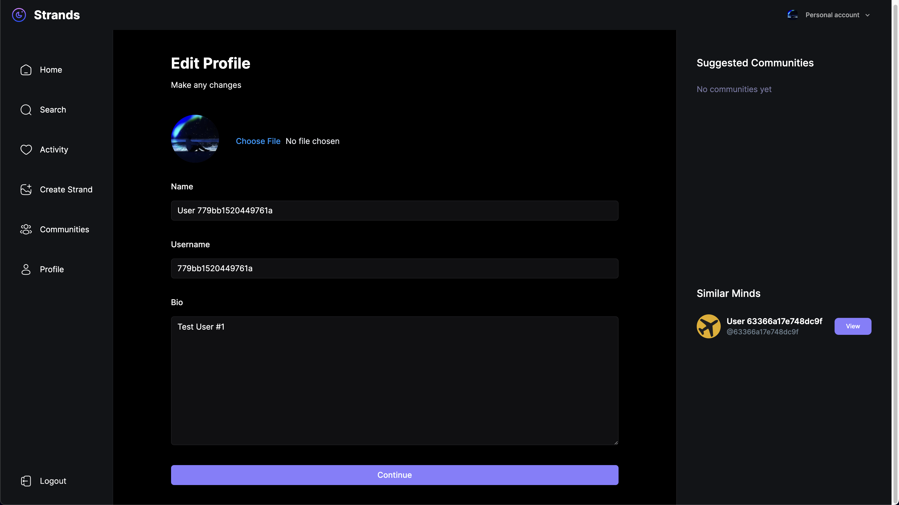
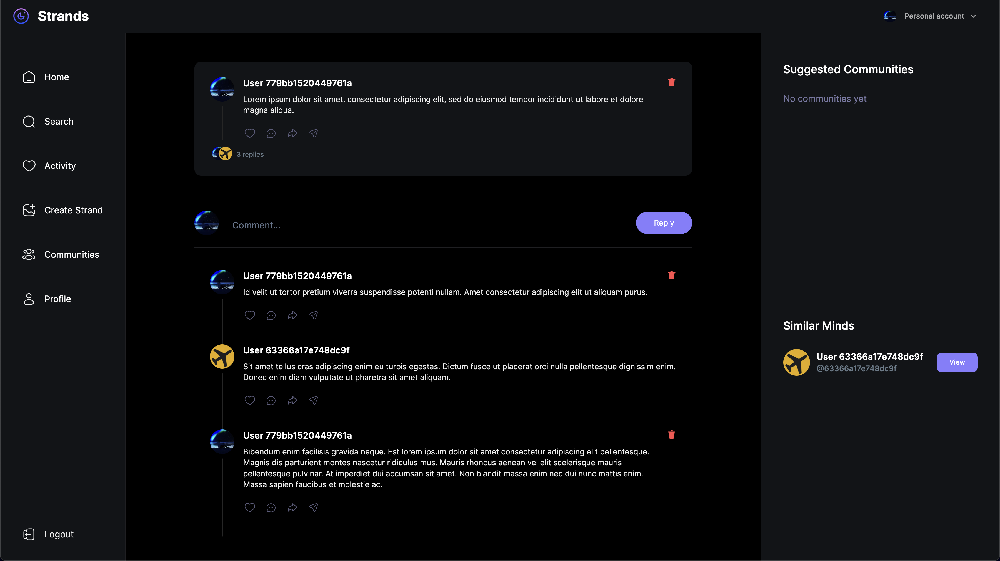

# Strands

Strands is a full-stack application modeled after Threads, built using the MERN stack (MongoDB, Express, React, Node.js). The project is designed to replicate the core functionalities of Threads, leveraging modern web development technologies and frameworks.

### Key Features:

1. Full-Stack MERN Application: Utilizes MongoDB for database management, Express for server-side operations, React for the frontend, and Node.js for the backend.
2. Next.js Integration: Built with Next.js to enhance performance and provide server-side rendering. The project is bootstrapped using create-next-app.
3. Tailwind CSS: Styled using Tailwind CSS for efficient and responsive design.
4. Vercel Deployment: The application is deployed on Vercel, providing easy scalability and seamless deployment processes.

### Screenshots:





This is a [Next.js](https://nextjs.org/) project bootstrapped with [`create-next-app`](https://github.com/vercel/next.js/tree/canary/packages/create-next-app).

## Getting Started

First, run the development server:

```bash
npm run dev
# or
yarn dev
# or
pnpm dev
# or
bun dev
```

Open [http://localhost:3000](http://localhost:3000) with your browser to see the result.

You can start editing the page by modifying `app/page.tsx`. The page auto-updates as you edit the file.

This project uses [`next/font`](https://nextjs.org/docs/basic-features/font-optimization) to automatically optimize and load Inter, a custom Google Font.

## Learn More

To learn more about Next.js, take a look at the following resources:

- [Next.js Documentation](https://nextjs.org/docs) - learn about Next.js features and API.
- [Learn Next.js](https://nextjs.org/learn) - an interactive Next.js tutorial.

You can check out [the Next.js GitHub repository](https://github.com/vercel/next.js/) - your feedback and contributions are welcome!

## Deploy on Vercel

The easiest way to deploy your Next.js app is to use the [Vercel Platform](https://vercel.com/new?utm_medium=default-template&filter=next.js&utm_source=create-next-app&utm_campaign=create-next-app-readme) from the creators of Next.js.

Check out our [Next.js deployment documentation](https://nextjs.org/docs/deployment) for more details.
